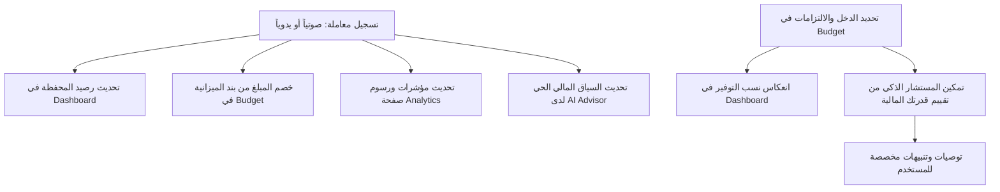

# 🌊 Flowin (فلو إن) - المساعد المالي والإنتاجي الذكي

> **Flowin** هو نظام مالي وإداري متكامل مصمم لإدارة التدفقات النقدية، المصروفات، الميزانيات، والأهداف اليومية بأسلوب سلس وذكي يعتمد على الذكاء الاصطناعي كشريك ومستشار مالي شخصي.

---

## 💡 فكرة المشروع ورؤية البزنس (Business Vision)

الكثير من الأشخاص يواجهون صعوبة في إدارة أموالهم لثلاثة أسباب رئيسية:
1. **تشتت الحسابات:** وجود أموال في محافظ متعددة (كاش، بطاقات بنكية، محافظ إلكترونية) وصعوبة معرفة الرصيد الفعلي في أي وقت.
2. **صعوبة التسجيل المستمر:** كسل المستخدمين عن إدخال كل معاملة يدوياً بسبب تعقيد وكثرة خطوات التطبيقات التقليدية.
3. **غياب الرؤية التوجيهية:** تسجيل الأرقام بدون معرفة أين يذهب المال، كم يتبقى للادخار، وكيفية اتخاذ قرارات مالية صحيحة.

**حل Flowin:**
توفير منصة ذكية موحدة تجمع كل محفظة مالية في مكان واحد، وتتيح تسجيل المعاملات في ثوانٍ بالصوت عبر الذكاء الاصطناعي، وربط المصروفات بميزانية شهرية واضحة، مع وجود مستشار مالي ذكي يتابع حساباتك لحظياً ويقدم لك حلولاً ونصائح مخصصة بناءً على وضعك الحقيقي.

---

## 🌟 الميزات الرئيسية لمنصة Flowin

### 1. 🎙️ التسجيل الصوتي الذكي للمصروفات (Voice Expense Tracking)
* التحدث الطبيعي باللغة العربية أو الإنجليزية لتسجيل المعاملة (مثال: *"صرفت 120 جنيه غداء كاش"*).
* يقوم الذكاء الاصطناعي بفهم الجملة واستخراج المبلغ، التصنيف، المتجر، والمحفظة المعنية تلقائياً، وعرضها للمستخدم لتأكيدها بلمسة واحدة.

### 2. 💼 إدارة المحافظ المتعددة (Multi-Wallet Management)
* إنشاء محافظ وحسابات غير محدودة (نقدي، بطاقات بنكية، محافظ ذكية).
* تتبع رصيد كل محفظة على حدة بدقة.
* إجراء التحويلات المالية الداخلية بين المحافظ بسهولة دون التأثير على إجمالي المصروفات أو الدخل.

### 3. 🎯 التخطيط المالي وتوزيع الميزانية (Budget & Savings Planning)
* تحديد الدخل الشهري الثابت.
* إنشاء ومتابعة الالتزامات الشهرية الأساسية (إيجار، فواتير، اشتراكات، أقساط).
* احتساب نسبة المصروفات الأساسية مقابل نسبة الادخار المتبقية تلقائياً وتوضيح المبالغ الصافية المتاحة.
* متابعة نسبة الاستهلاك لكل بند أساسي في الوقت الفعلي مع تنبيهات عند تجاوز الحد المسموح.

### 4. 📊 التحليلات والتقارير المالية المتقدمة (Analytics & Insights)
* مقارنة الأداء المالي بين الفترات الزمنية (هذا الشهر مقابل الشهر السابق).
* رسوم بيانية توضح توزيع الصرف حسب التصنيفات، المتاجر، والمحافظ.
* تتبع صافي التدفق النقدي ومعدل الصرف اليومي.
* سجل شامل وقابل للبحث والتصفية لجميع المعاملات السابقة.

### 5. 🤖 المستشار المالي الشخصي بالذكاء الاصطناعي (AI Financial Advisor)
* شات ذكي تفاعلي يفهم الصورة الكاملة لأموالك بشكل حي (الأرصدة، الالتزامات، والمصروفات الأخيرة).
* إمكانية سؤاله عن أي قرار مالي (مثال: *"هل وضعي المالي يسمح بشراء لابتوب هذا الشهر؟"*).
* تقديم تقارير دورية تقيّم الصحة المالية للمستخدم وتقترح طرقاً عملية لتقليل الهدر وزيادة الادخار.

### 6. ✅ إدارة المهام اليومية (Daily Tasks & Habits)
* دمج الإنتاجية مع الإدارة المالية لمساعدة المستخدم على تنظيم أولوياته ومهامه اليومية ومتابعة عاداته المالية والتنظيمية.

---

## 📱 صفحات التطبيق ووظائفها

| الصفحة | دورها في التطبيق |
| :--- | :--- |
| **لوحة التحكم (Dashboard)** | الواجهة الرئيسية؛ تعرض إجمالي الرصيد عبر كل المحافظ، ملخص الدخل والمصروفات للشهر، قائمة المحافظ السريعة، آخر المعاملات، وأزرار المعاملات السريعة والتسجيل الصوتي. |
| **الميزانية (Budget)** | صفحة التخطيط المالي؛ يُحدد فيها الدخل الشهري والالتزامات الأساسية لمراقبة الصرف الثابت مقابل الأهداف الادخارية. |
| **التحليلات (Analytics)** | صفحة التقارير؛ تقدم رؤية بيانية وتفصيلية لهيكل المصروفات، سلوك الشراء، والمقارنات الشهرية. |
| **المساعد الذكي (AI Assistant)** | مساحة المحادثة مع المستشار المالي وتحليلات الذكاء الاصطناعي الأسبوعية. |
| **المهام اليومية (Daily Tasks)** | صفحة لتنظيم المهام اليومية والمتابعة الروتينية لتعزيز الإنتاجية والانضباط الشخصي. |
| **الإعدادات (Settings)** | تخصيص تجربة الاستخدام (تغيير اللغة بين العربية والإنجليزية، إعدادات الملف الشخصي، وإدارة الحساب). |

---

## 🔄 الترابط والتكامل بين صفحات التطبيق (System Ecosystem)

تعتمد منصة **Flowin** على دورة بيانات موحدة ومترابطة لحظياً:

### كيف يخدم هذا الترابط المستخدم؟
1. **تسجيل واحد يُحدث كل شيء:** بمجرد تسجيلك لمصروف (مثلاً غداء بـ 150 ج.م):
   - يُخصم فوراً من محفظة الدفع المحددة في **Dashboard**.
   - يُحتسب ضمن استهلاك فئة الطعام في **Budget**.
   - يُسجل في تحليلات الرسم البياني وسجل المعاملات في **Analytics**.
   - يتعرف عليه **المساعد المالي (AI)** فوراً ليقدم لك نصائح دقيقة مبنية على رصيدك الجديد.
2. **التحويل بين المحافظ:** عند تحويل أموال بين محفظتين، يتم ضبط أرصدة المحافظ دون التأثير على إحصائيات الدخل أو المصروفات الحقيقية.
3. **تكامل الميزانية والذكاء الاصطناعي:** معرفة الذكاء الاصطناعي بالتزاماتك المسجلة في صفحة الميزانية يجعله قادراً على تحذيرك قبل أن تصرف من أموال مخصصة لالتزامات قادمة.

---

## 🎯 دور الذكاء الاصطناعي (AI) في المنصة

الذكاء الاصطناعي في **Flowin** ليس مجرد أداة محادثة عامة، بل هو **محرك مالي مخصص لك**:
* **فهم اللهجات والسياق المالي:** القدرة على استخراج التفاصيل المالية من الجمل الصوتية العفوية.
* **الوعي المالي الكامل (Live Financial Awareness):** يرى الذكاء الاصطناعي أرقامك الحقيقية ومحافظك ومصروفاتك لحظياً للإجابة على استفساراتك بأرقام واقعية وليست نصائح عامة.
* **التحليل الاستباقي:** اكتشاف أنماط الصرف الزائد وتنبيه المستخدم لاقتناص فرص توفير إضافية.